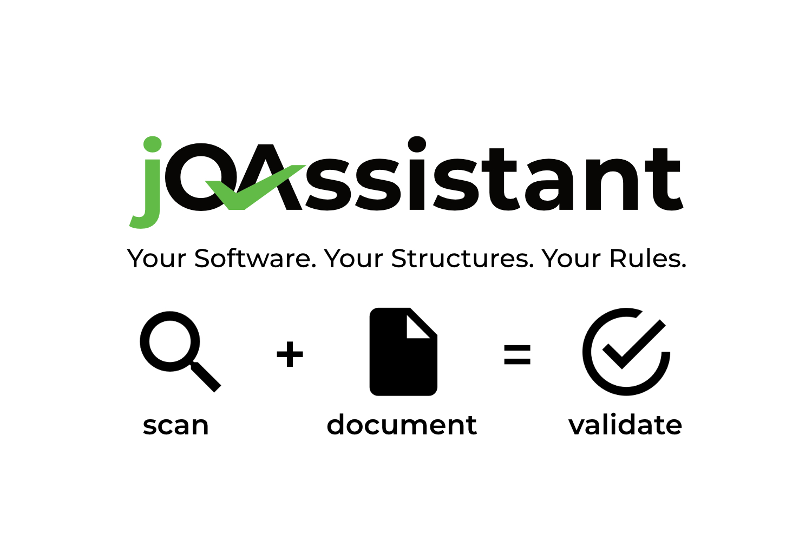

:numbered:
:sectlinks:
:sectnumlevels: 2
:toclevels: 2

= jQAssistant User Manual
jQAssistant <info@jqassistant.org> @jqassistant

This document describes the concepts of jQAssistant and usage information.

[abstract]
include::include/overview.adoc[]

include::include/license.adoc[]

include::include/quickstart.adoc[]

include::include/introduction.adoc[]

include::{docRoot}/com.buschmais.jqassistant.cli/parent/asciidoc/readme.adoc[]

include::{docRoot}/com.buschmais.jqassistant/jqassistant-maven-plugin/asciidoc/readme.adoc[]

include::include/configuration.adoc[]

include::include/plugins.adoc[]

:leveloffset: +1

include::include/known-issues.adoc[]

:leveloffset: -1
