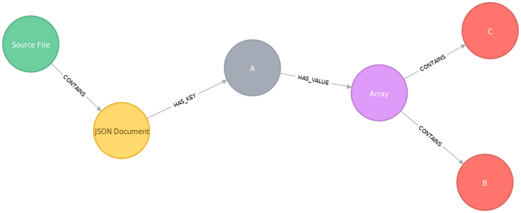

=== Examples

This section provides some examples how a JSON document is
mapped to a graph structure by the JSON plugin of jQAssistant.

==== Object with Array Value
//
// Source is object-with-array-two-elements.json
//

.An JSON object with a single key with an array as value
[source,json]
----
include::example-01/example-01.json[]
----

.Graph structure created out of the source document

==== Empty JSON Array
//
// Source is array-empty.json
//

.An empty JSON array
[source,json]
----
include::example-02/example-02.json[]
----

.Graph struture created out of the source document
image::example-02/example-02.svg[imagesdir=.]

==== Object with an empty Object as Value
//
// Source is object-with-object-empty.json
//

.An JSON object with an empty Object as Value
[source,json]
----
include::example-03/example-03.json[]
----

.Graph struture created out of the source document

==== JSON Object with Objects as Value
//
// Source is object-with-objects.json
//

.An JSON object objects as value
[source,json]
----
include::example-04/example-04.json[]
----

.Graph struture created out of the source document

